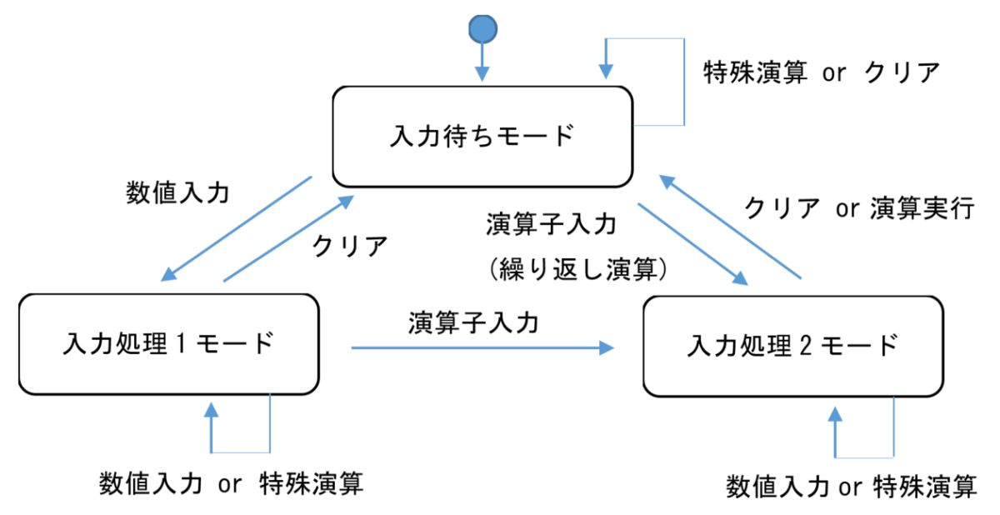

> 3.1 概要
> ウィンドウから最小化が可能で、プログラムを終了する場合は、「×」ボタンを選択するとプログラムを終了する。

ウィンドウから最小化でき、X ボタンでプログラムが終了する。

> 各種操作は、ボタンから実行し、数値「0 ～ 9」の整数と、「．」含めた小数を表現できる。また、基本演算機能として、「加算・減算・乗算・除算・剰余」があり、特殊演算機能として、「平方根・符号反転」の演算を実行できる。
>
> 演算処理を実行する場合は、「＝」を選択することで、表示エリアに演算結果を出力する。また、演算結果を出力後、再度演算子（＋、－、＊、／、％）を入力することで、繰り返し演算も可能である。さらに、演算をクリアする場合は、「C」を選択することで、最初から演算をやり直すことができる。
>
> 3.2 機能要求
> 　機能要求を下記に示す。
>
> 3.2.1 入力機能
> 3.2.1.1 整数の入力
> 　操作エリアから 0 ～ 9 を入力できる。

入力できる。
ただし、文字を連続入力する際、操作エリア内で表示された数字より左側を
クリックしてしまうと以降の数字の入力位置が右端にならない。

1. '1'を入力
2. 操作エリア内で表示された'1'より左側をクリック
3. '2'を入力
4. '3'を入力
   で操作エリアに表示されるのは'231'

> 3.2.1.2 小数の入力
> 　操作エリアから「．」を入力することで、小数を表現できる。

表現できている。
ただし、'.'をクリックした際と'.'を操作エリアに入力した際とで挙動が異なる。

- '.'をクリックした際、操作エリアには 0 がアペンドされて'0.'と表示される
- '.'を操作エリアに入力した際、操作エリアには 0 がアペンドされず'.'と表示される。ただし、その後数字を数字すると少数としては扱われる。

「概要」に「各種操作は、ボタンから実行し、」とあるので操作エリアにフォーカスしてボタンではなくキーボードから入力するのは前提から外れるものとなる。

> 3.2.1.3 演算子の入力
> 　操作エリアから「加算・減算・乗算・除算・剰余」を表す、「＋」「－」「＊」「／」「％」を入力できる。

「＋」「－」「＊」「／」「％」を入力できる。ただし、操作エリアに表示されないため入力されたか不安は残る。

> 3.2.1.4 特殊演算の入力
> 　四則演算・剰余以外の特殊な演算として、操作エリアから、「平方根」「符号反転」を表す、「√」「＋／－」を入力できる。

入力できる。

> 3.2.1.5 演算実行の入力
> 　操作エリアから「＝」を入力できる。

入力できる。

> 3.2.1.6 クリアの入力
> 　操作エリアから入力内容のクリアを表す、「C」を入力できる。

入力できる。

> 3.2.2 演算機能
> 　指定の入力に従って式を入力後、操作エリアから「＝」を選択することで、下記の演算を実行できる。
>
> 3.2.2.1 基本演算
> 　入力情報に従って、「加算・減算・乗算・除算・剰余」を実行できる。

3.2.1.3 で実施済み。

> 3.2.2.2 繰り返し演算
> 　一度演算した後、繰り返し演算が実行できる。

"繰り返し演算"を以下のものとする。この前提のもとでできる。

1. '1'を入力
2. '+'を入力
3. '2'を入力
4. '='を入力
5. '+'を入力
6. '7'を入力
7. '='を入力

> 3.2.3 特殊演算
> 　「平方根・符号反転」を実行できる。

3.2.1.4 で実施済み。

> 3.2.4 表示機能
> 　操作エリアからの入力情報や演算結果は、表示エリアに表示できる。なお、入出力する桁数は、最大で整数部 3 桁、小数部 3 桁とする（○○○.○○○）。

できる。

> 3.3 詳細設計
> 3.3.1 状態遷移図・状態遷移表
> 　状態遷移図（図 2）、状態遷移表（表 1）を下記に示す。
>
>  >
>
> 3.3.1 初期処理
> 　プログラムを開始すると、入力待ちモードに遷移する。また、「＝」ボタンは無効化する。

3.1 で実施済み。

> 3.3.2 数値入力イベント
> 3.3.2.1 入力待ちモード
> 　操作エリアから「0 ～ 9」か「．」の入力がある場合は、入力情報を表示エリアに表示し、入力処理 1 に遷移する。ただし、未入力の状態で「．」を選択した場合は、「0.」を表示する。

3.2.1.1, 3.2.1.2 で実施済み

> 3.3.2.2 入力処理 1 モード、入力処理 2 モード
> 　操作エリアから「0 ～ 9」か「．」の入力がある場合は、表示エリアに数値を表示する。ただし、以下のルールがある。
>
> 数値が既に存在する場合は、右から連結して表示する
> 例：12 の状態で 1 を入力すると、121 となる
> 先頭に 0 がある場合は、0 を 2 回続けて入力できない。また、0 の後に数値を入力した場合は、0 を別の数値に上書きする
> 未入力の状態で「.」を選択した場合は、先頭に 0.を付与する
> 小数は最大で 3 桁までしか入力できない
> 入力値の制限は、最大値（999.999）、最小値（－999.999）とする

右から連結されて表示される
0 を一つ入力できる
0 を 2 つ連続で入力できない
0 が一つ入力された状態で 1 から 9 のいずれかを入力すると 0 が消えて入力された non-0 が表示される
.の入力で 0.が表示される
整数部の最大桁数は 3 桁
小数部の最大桁数は 3 桁

> 3.3.3 演算子入力イベント
> 3.3.3.1 入力処理 1 モード
> 　演算子（＋、－、＊、／、％）を入力した場合は、表示エリアの入力情報と入力した演算子を記憶し、入力処理 2 に遷移する。また、表示エリアをクリアし、（＋、－、＊、／、％）ボタンを無効化し、「＝」ボタンを有効化する。

%が無効化されていない。

> 3.3.3.2 入力待ちモード
> 　繰り返し演算（1 回演算した後、続けて演算子（＋、－、＊、／、％）を入力）した場合は、表示エリアの入力情報と選択した演算子を取得する。さらに、表示エリアをクリアし、入力処理 2 に遷移する。また、「＋、－、＊、／、％」ボタンを無効化、「＝」ボタンを有効化する。

%が無効化されていない。

> 3.3.4 特殊演算イベント
> 3.3.4.1 入力待ちモード、入力処理 1 モード、入力処理 2 モード
> 　特殊演算を行う場合は、演算結果を表示エリアに表示する。
>
> 表示エリアが空欄以外で、√ を入力する場合は、表示エリアの入力情報から平方根を演算し、表示エリアに表示する。なお、出力が小数第 4 位以降となる場合は、小数第 4 位を四捨五入し、3 桁で表示する。
> 表示エリアが空欄以外で、＋／－を入力する場合は、表示エリアの入力情報から符号を反転し、表示エリアに表示する。

何も入力していない状態で √ をクリックしても何も起きない
数値が入力された状態で √ をクリックすると平方根が表示される
平方根は少数第 3 位で四捨五入される
何も入力していない状態で+/-をクリックしても何も起きない
整数、少数、0 を入力した上で+/-をクリックすると-マークが付く
ある値が表示された状態で+/-を数回クリックするとクリックの度に − マークが付いたり消えたりする

> 3.3.5 クリアイベント
> 3.3.5.1 入力待ちモード、入力処理 1 モード、入力処理 2 モード
> 　「C」を選択した場合は、表示エリアの文字、表示エリアと演算子の入力情報、ボタンの状態を初期状態に戻す。また、入力待ちモードに遷移する。

入力待ちモードにおいて=が有効であるべきか、無効であるべきか、はっきりしないためバグとは言い切れないが"1 + 2 C"と入力しても=が無効化されない。

そもそも『表示エリアの文字、表示エリアと演算子の入力情報、ボタンの状態を初期状態に戻す。』と記載されているが『初期状態』が明示的に定義されていない。関係するものとしては『3.3.1 初期処理 　プログラムを開始すると、入力待ちモードに遷移する。また、「＝」ボタンは無効化する。』という記述がある。これから初期状態を推測すると C の後に=が無効化されないのはバグであるがあくまで推測に基づく。

また、『表示エリアの文字、表示エリアと演算子の入力情報、ボタンの状態を初期状態に戻す』のうち Calculator.py の中を見ずに判断できるのは表示エリアの文字とボタンの状態のみで、表示エリアと演算子の入力情報が初期状態に戻ったかどうかは分からない。ただし、続いて入力した 3 + 4 =は 7 となるため入力情報はクリアされたと思われる。

> 3.3.6 演算実行イベント
> 3.3.6.1 入力待ちモード、入力処理 2 モード
> 　表示エリアが空欄でない状態で、「＝」ボタンを選択した場合、下記の演算結果を表示エリアに表示し、入力待ちモードに遷移する。遷移する際、「＋、－、＊、／、％」ボタンを有効化し、「＝」を無効化する。なお、出力結果は、小数となる場合は、小数第 4 位を四捨五入し、3 桁として表示する。
>
> 通常の演算の場合
> 演算子が「＋」の場合
> 演算結果＝入力処理 1 モードの入力情報＋入力処理 2 モードの入力情報
> 演算子が「－」の場合
> 演算結果＝入力処理 1 モードの入力情報－入力処理 2 モードの入力情報
> 演算子が「＊」の場合
> 演算結果＝入力処理 1 モードの入力情報＊入力処理 2 モードの入力情報
> 演算子が「／」の場合
> 演算結果＝入力処理 1 モードの入力情報／入力処理 2 モードの入力情報
> 演算子が「％」の場合
> 演算結果＝入力処理 1 モードの入力情報％入力処理 2 モードの入力情報
> 繰り返し演算の場合
> 演算子が「＋」の場合
> 演算結果＝入力待ちモードの入力情報＋入力処理 2 モードの入力情報
> 演算子が「－」の場合
> 演算結果＝入力待ちモードの入力情報－入力処理 2 モードの入力情報
> 演算子が「＊」の場合
> 演算結果＝入力待ちモードの入力情報＊入力処理 2 モードの入力情報
> 演算子が「／」の場合
> 演算結果＝入力待ちモードの入力情報／入力処理 2 モードの入力情報
> 演算子が「％」の場合
> 演算結果＝入力待ちモードの入力情報％入力処理 2 モードの入力情報
> 　また、演算結果の最大、最小の処理は以下とする。
> 最大：演算結果＞ 3000 の場合
> 演算結果＝ 3000
> 最小：演算結果＜－3000 の場合
> 演算結果＝－3000

1. %について
   %はこれまで同様有効化され続ける。

   『表示エリアが空欄でない状態で、「＝」ボタンを選択した場合、下記の演算結果を表示エリアに表示し、入力待ちモードに遷移する。遷移する際、「＋、－、＊、／、％」ボタンを有効化し、「＝」を無効化する。』
   +-\*/%の演算子について『無効状態から有効化し』とあればバグと明確に判断できる。

2. 四捨五入
   小数第 4 位を四捨五入し、3 桁として表示されている。

3. =の無効化、有効化タイミング
   - 無効化
     - 起動時
     - =は入力処理 2 モードで=がクリックされた場合
   - 変更無し
     - 入力待ちモードでは何をクリックしても=の無効、有効は変わらない
   - 有効化
     - 入力処理 2 モードに遷移した際('1 +'の時点で=が有効化される。ただし、このクリック=をクリックしても無視される。遷移表によれば・・・)

> 3.4 制限事項
> テスト項目を記述するのが面倒になることが予想されるため、プログラムに入力できる最大、最小の数値は 999.999 と－999.999 に制限する。また、演算結果の最大、最小は、3000 と－3000 に制限する
> ソースコードはブラックボックスとして取り扱うこと（厳密な状態遷移ベースのプログラムとなっていないため）

最大値、最小値については 3.3.6.1 で実施済み。
999.999 と-999.999 については入力できて、その後計算もできた。
4 桁入力については 3.2.4 で実施済み。
