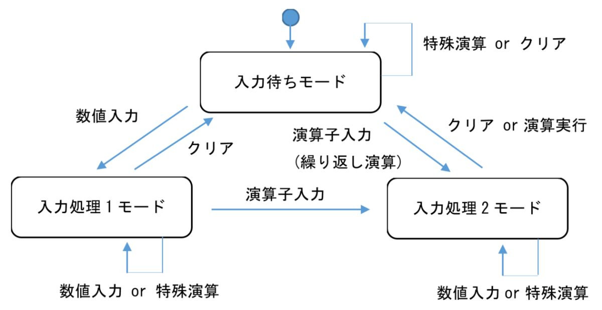
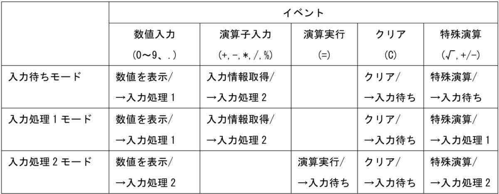

各種操作は、ボタンから実行し、数値「0 ～ 9」の整数と、「．」含めた小数を表現できる。また、基本演算機能として、「加算・減算・乗算・除算・剰余」があり、特殊演算機能として、「平方根・符号反転」の演算を実行できる。

演算処理を実行する場合は、「＝」を選択することで、表示エリアに演算結果を出力する。また、演算結果を出力後、再度演算子（＋、－、＊、／、％）を入力することで、繰り返し演算も可能である。さらに、演算をクリアする場合は、「C」を選択することで、最初から演算をやり直すことができる。

3.2 機能要求
　機能要求を下記に示す。

3.2.1 入力機能
3.2.1.1 整数の入力
　操作エリアから 0 ～ 9 を入力できる。

3.2.1.2 小数の入力
　操作エリアから「．」を入力することで、小数を表現できる。

3.2.1.3 演算子の入力
　操作エリアから「加算・減算・乗算・除算・剰余」を表す、「＋」「－」「＊」「／」「％」を入力できる。

3.2.1.4 特殊演算の入力
　四則演算・剰余以外の特殊な演算として、操作エリアから、「平方根」「符号反転」を表す、「√」「＋／－」を入力できる。

3.2.1.5 演算実行の入力
　操作エリアから「＝」を入力できる。

3.2.1.6 クリアの入力
　操作エリアから入力内容のクリアを表す、「C」を入力できる。

3.2.2 演算機能
　指定の入力に従って式を入力後、操作エリアから「＝」を選択することで、下記の演算を実行できる。

3.2.2.1 基本演算
　入力情報に従って、「加算・減算・乗算・除算・剰余」を実行できる。

3.2.2.2 繰り返し演算
　一度演算した後、繰り返し演算が実行できる。

3.2.3 特殊演算
　「平方根・符号反転」を実行できる。

3.2.4 表示機能
　操作エリアからの入力情報や演算結果は、表示エリアに表示できる。なお、入出力する桁数は、最大で整数部 3 桁、小数部 3 桁とする（○○○.○○○）。

3.3 詳細設計
3.3.1 状態遷移図・状態遷移表
　状態遷移図（図 2）、状態遷移表（表 1）を下記に示す。

3.3.1 初期処理
　プログラムを開始すると、入力待ちモードに遷移する。また、「＝」ボタンは無効化する。

3.3.2 数値入力イベント
3.3.2.1 入力待ちモード
　操作エリアから「0 ～ 9」か「．」の入力がある場合は、入力情報を表示エリアに表示し、入力処理 1 に遷移する。ただし、未入力の状態で「．」を選択した場合は、「0.」を表示する。

3.3.2.2 入力処理 1 モード、入力処理 2 モード
　操作エリアから「0 ～ 9」か「．」の入力がある場合は、表示エリアに数値を表示する。ただし、以下のルールがある。

数値が既に存在する場合は、右から連結して表示する
例：12 の状態で 1 を入力すると、121 となる
先頭に 0 がある場合は、0 を 2 回続けて入力できない。また、0 の後に数値を入力した場合は、0 を別の数値に上書きする
未入力の状態で「.」を選択した場合は、先頭に 0.を付与する
小数は最大で 3 桁までしか入力できない
入力値の制限は、最大値（999.999）、最小値（－999.999）とする

3.3.3 演算子入力イベント
3.3.3.1 入力処理 1 モード
　演算子（＋、－、＊、／、％）を入力した場合は、表示エリアの入力情報と入力した演算子を記憶し、入力処理 2 に遷移する。また、表示エリアをクリアし、（＋、－、＊、／、％）ボタンを無効化し、「＝」ボタンを有効化する。

3.3.3.2 入力待ちモード
　繰り返し演算（1 回演算した後、続けて演算子（＋、－、＊、／、％）を入力）した場合は、表示エリアの入力情報と選択した演算子を取得する。さらに、表示エリアをクリアし、入力処理 2 に遷移する。また、「＋、－、＊、／、％」ボタンを無効化、「＝」ボタンを有効化する。

3.3.4 特殊演算イベント
3.3.4.1 入力待ちモード、入力処理 1 モード、入力処理 2 モード
　特殊演算を行う場合は、演算結果を表示エリアに表示する。

表示エリアが空欄以外で、√ を入力する場合は、表示エリアの入力情報から平方根を演算し、表示エリアに表示する。なお、出力が小数第 4 位以降となる場合は、小数第 4 位を四捨五入し、3 桁で表示する。
表示エリアが空欄以外で、＋／－を入力する場合は、表示エリアの入力情報から符号を反転し、表示エリアに表示する。
3.3.5 クリアイベント
3.3.5.1 入力待ちモード、入力処理 1 モード、入力処理 2 モード
　「C」を選択した場合は、表示エリアの文字、表示エリアと演算子の入力情報、ボタンの状態を初期状態に戻す。また、入力待ちモードに遷移する。

3.3.6 演算実行イベント
3.3.6.1 入力待ちモード、入力処理 2 モード
　表示エリアが空欄でない状態で、「＝」ボタンを選択した場合、下記の演算結果を表示エリアに表示し、入力待ちモードに遷移する。遷移する際、「＋、－、＊、／、％」ボタンを有効化し、「＝」を無効化する。なお、出力結果は、小数となる場合は、小数第 4 位を四捨五入し、3 桁として表示する。

通常の演算の場合
演算子が「＋」の場合
演算結果＝入力処理 1 モードの入力情報＋入力処理 2 モードの入力情報
演算子が「－」の場合
演算結果＝入力処理 1 モードの入力情報－入力処理 2 モードの入力情報
演算子が「＊」の場合
演算結果＝入力処理 1 モードの入力情報＊入力処理 2 モードの入力情報
演算子が「／」の場合
演算結果＝入力処理 1 モードの入力情報／入力処理 2 モードの入力情報
演算子が「％」の場合
演算結果＝入力処理 1 モードの入力情報％入力処理 2 モードの入力情報
繰り返し演算の場合
演算子が「＋」の場合
演算結果＝入力待ちモードの入力情報＋入力処理 2 モードの入力情報
演算子が「－」の場合
演算結果＝入力待ちモードの入力情報－入力処理 2 モードの入力情報
演算子が「＊」の場合
演算結果＝入力待ちモードの入力情報＊入力処理 2 モードの入力情報
演算子が「／」の場合
演算結果＝入力待ちモードの入力情報／入力処理 2 モードの入力情報
演算子が「％」の場合
演算結果＝入力待ちモードの入力情報％入力処理 2 モードの入力情報
　また、演算結果の最大、最小の処理は以下とする。

最大：演算結果＞ 3000 の場合
演算結果＝ 3000
最小：演算結果＜－3000 の場合
演算結果＝－3000
3.4 制限事項
テスト項目を記述するのが面倒になることが予想されるため、プログラムに入力できる最大、最小の数値は 999.999 と－999.999 に制限する。また、演算結果の最大、最小は、3000 と－3000 に制限する
ソースコードはブラックボックスとして取り扱うこと（厳密な状態遷移ベースのプログラムとなっていないため）
